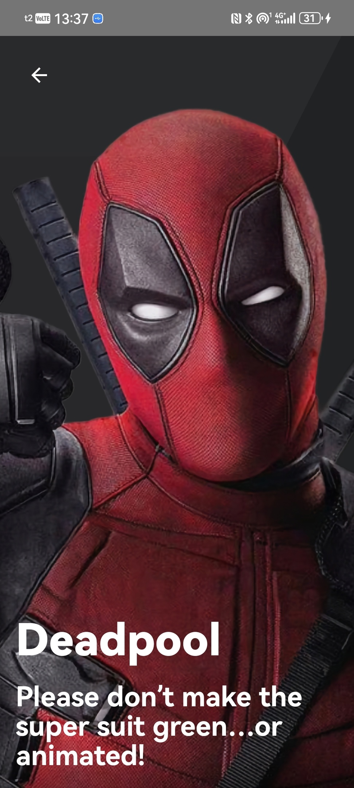

# Русяева Анастасия МПБ-201

Этот репозиторий создан для хранения работы по предмету: Мобильная разработка
При разработке использовались такие инструменты как: андроид студио и градл.
Итоговый вариант одного из заданий выглядит так:
